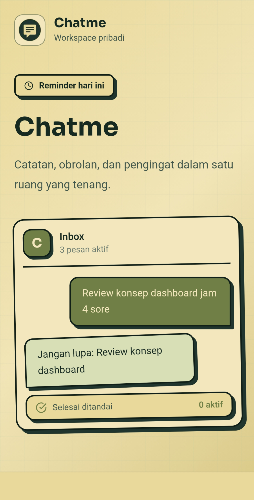
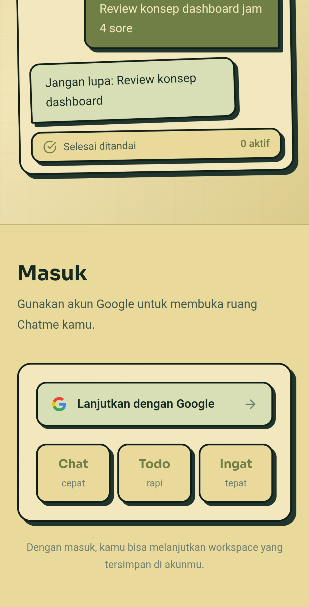
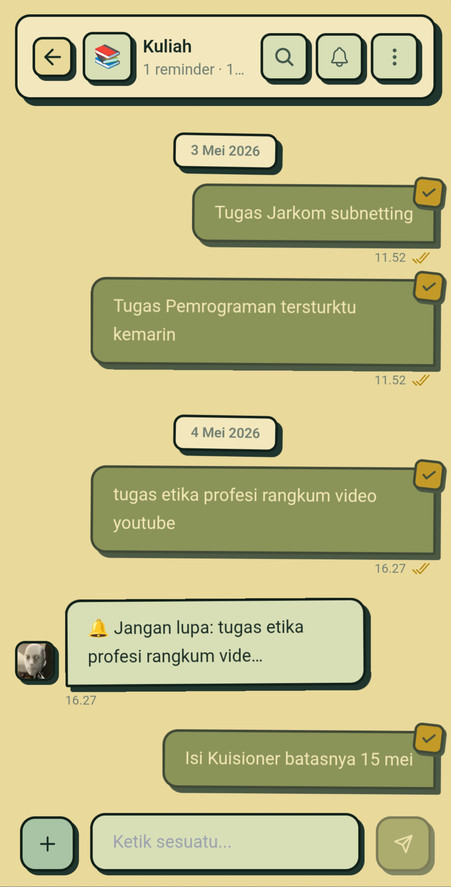
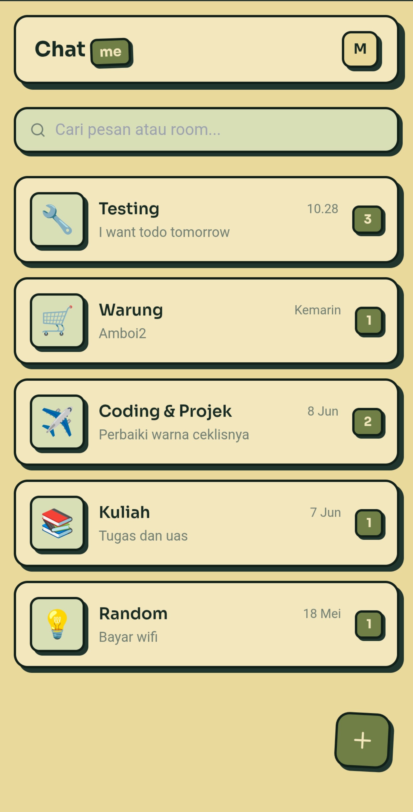
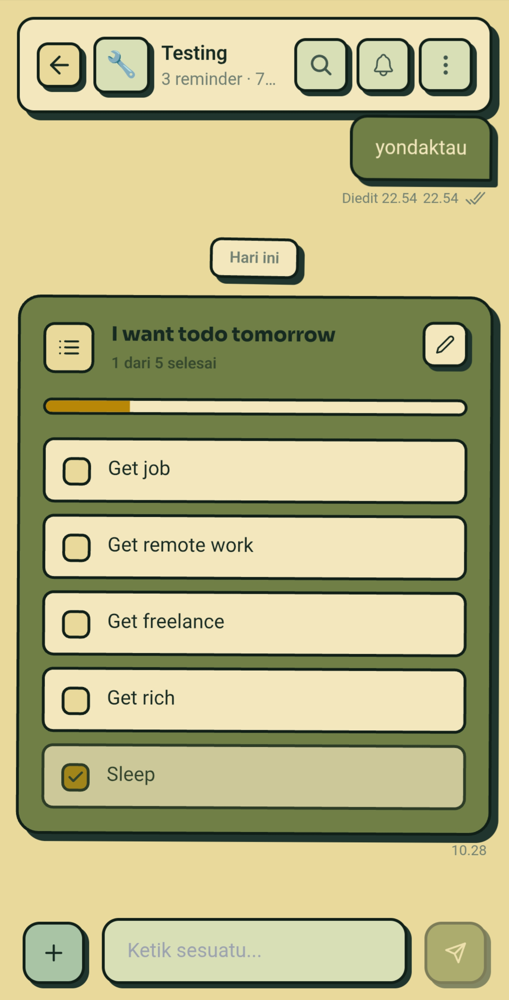
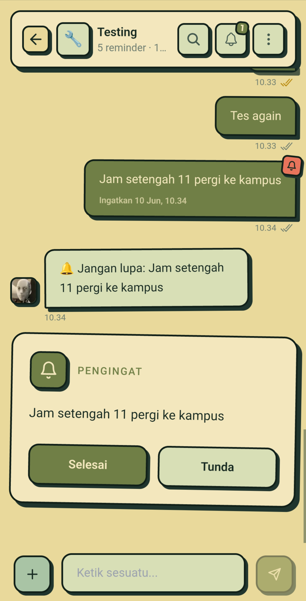

# Chatme

> I used WhatsApp as my notes app.
>
> So I built a notes app that feels like WhatsApp.

Chatme is a chat-based note-taking and reminder application inspired by a simple habit many people already have: sending messages to themselves.

Instead of forcing users into complex folders, pages, and databases, Chatme keeps things familiar. Just type a message and save your thoughts as naturally as having a conversation.

---

## Why Chatme?

For years, I used WhatsApp as a personal note-taking tool.

Whenever I had an idea, task, reminder, or something important to remember, I would simply send a message to myself.

```text
Pay electricity bill tomorrow

Finish networking assignment

Project idea:
- Add reminder feature
- Improve landing page

Okowi owes me Rp19.000
```

The workflow was fast and familiar.

The problem?

WhatsApp was never designed to be a second brain.

Notes get buried, reminders are easy to miss, and personal information becomes difficult to organize.

Chatme was created to solve that problem.

It keeps the simplicity of messaging while providing tools specifically built for personal knowledge, reminders, and daily organization.

---

## Features

### 💬 Chat-Based Notes

Create notes by simply sending messages.

No documents. No pages. No complicated structure.

Just write.

### 📂 Rooms

Organize messages into separate rooms.

Examples:

- Personal
- Ideas
- College
- Work
- Finance
- Projects

### ✅ Checklist Support

Turn messages into actionable checklists and track completed tasks.

### ⏰ Reminders

Schedule reminders directly from messages.

Never forget important tasks again.

### 🔍 Search Messages

Quickly find old ideas, notes, and reminders.


---

## Preview

### Landing Page

<p align="center">
  
  
</p>

### Chat Room

<p align="center">
  
</p>

### Room List

<p align="center">
  
</p>

### Checklist

<p align="center">
  
</p>

### Reminder

<p align="center">
  
</p>

---

## Philosophy

Chatme is not trying to replace tools like Notion, Obsidian, or Evernote.

It is built for people who already think through chat.

Sometimes all you need is a place to quickly type:

```text
Don't forget this.
```

and move on with your day.

---

## Tech Stack

- React
- TypeScript
- Tailwind CSS
- Vite
- PWA

---

## Status

🚧 Currently in Development

Chatme is actively being built and improved.

---

Built with ☕ and countless messages sent to myself.